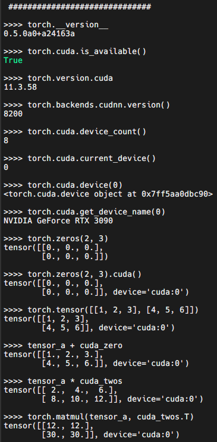

# Pytorch0.4.1 with CUDA 11 and cudnn 8.2
This is a repo for setup Pytorch0.4.1 with CUDA 11 and cudnn 8.2

1. Download CUDA 11 and cudnn 8.2 from Nvidia. I use `cuda_11.3.0_465.19.01_linux.run` and `cudnn-11.3-linux-x64-v8.2.0.53.tgz`. Set up your CUDA_HOME and LD_LIBRARY_PATH in your `.bashrc`.

2. Install dependencies from conda.

```bash
conda create -n "pytorch0.4" python=3.7
conda activate "pytorch0.4"
conda install numpy pyyaml mkl mkl-include setuptools cmake cffi typing
```

3. Recursively Clone Pytorch0.4.1 from `https://github.com/garry1ng/pytorch0.4.1_cuda11.git`. Make sure the submodules except nervanagpu are also included. 

```bash
git clone https://github.com/garry1ng/pytorch0.4.1_cuda11.git
cd pytorch0.4.1_cuda11/
# git submodule deinit third_party/nervanagpu/
# git rm third_party/nervanagpu
git submodule sync
git submodule update --init --recursive
```

<!-- 4. Apply the patch `pytorch0.4.1_cuda11_cudnn8.2.patch`. It should include all the things you want.

```bash
git apply --check pytorch0.4.1_cuda11_cudnn8.2.patch
git apply pytorch0.4.1_cuda11_cudnn8.2.patch
``` -->

4. Install PyTorch.
```bash
python setup.py install
```

5. run `test_pytorch0.4_cu11_cudnn.py` to check if it is correctly installed. You should have some output like this:



Note: the patch may be outdated if the third party libraries update (very unlikely though). Locating these files can save time.

- third_party/nccl/src/common_coll.h
- third_party/gloo/cmake/Cuda.cmake